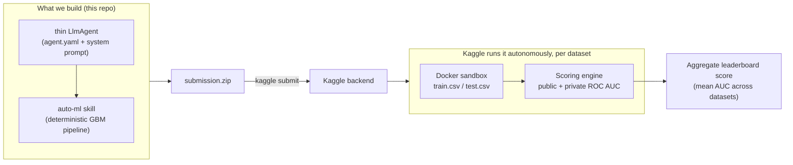

# Autonomous Agent Prediction (Beta) — Kaggle-in-Kaggle Agent

An autonomous ML **agent** submission for Kaggle's
[Autonomous Agent Prediction (Beta)](https://www.kaggle.com/competitions/autonomous-agent-prediction-beta)
competition. Instead of uploading a CSV of predictions, we upload a small
[Google ADK](https://google.github.io/adk-docs/) agent that Kaggle runs **fully autonomously, with no
human in the loop**, inside a locked-down sandbox — where it must explore data, train models, and
submit predictions for **16 tabular binary-classification datasets**, scored on **ROC AUC**.

Our design is a **thin LLM agent + one deterministic modeling skill**: the LLM merely orchestrates,
while all the intelligence lives in a pre-tested gradient-boosting pipeline bundled as a skill.

> 📚 **Full documentation is in [`docs/`](docs/README.md)** — competition mechanics, data, harness
> internals, strategy, the modeling pipeline, the agent design, the dev workflow, and results.

---

## Results

| | Offline mean AUC | Public LB |
| :--- | :--- | :--- |
| v1 — untuned greedy 3-GBM blend | ~0.798 | **0.805** |
| v2 — tuned (early stopping) greedy blend | ~0.8025 | **0.809** |
| Leaderboard top (cluster 0.823–0.830) | | 0.830 |

The headline finding: **our offline score (against the provided `solution.csv`) predicts the
leaderboard almost exactly** — confirmed twice now, including matching the v1→v2 *delta* (+0.004
offline → +0.004 on the leaderboard). That lets us iterate the model entirely offline — free, no LLM,
no Docker, no submission slots — and only submit when we have a *measured* gain.

---

## How it works



- **Modeling pipeline** — infers each column's type from the data (no schema file at eval time),
  one-hot-encodes low-cardinality categoricals, ordinal-encodes `ord_*` columns, keeps numeric with
  NaN preserved, then trains an early-stopping **LightGBM + XGBoost + CatBoost** blend with
  greedy (Caruana) weighting on out-of-fold predictions.
- **Thin agent** — `load_skill → run_skill_script → submit_predictions → select_submission`. Uses
  ~6 LLM calls and ~$0.01 per dataset; all intelligence is in the deterministic skill.

---

## Repository structure

```
.
├── docs/                          # 📚 full project documentation (start at docs/README.md)
├── README.md                      # this file
├── KAGGLE_COMPETITION_PLAN.md     # original planning doc (mechanics + ported knowledge)
├── dev/                           # offline modeling dev loop (no LLM/Docker)
│   ├── pipeline.py                #   schema-adaptive pipeline (library form)
│   ├── score_all_folds.py         #   run + score all 16 folds vs solution.csv
│   ├── experiment.py              #   cache per-model OOF/test arrays, search blends
│   ├── tune.py                    #   tuning experiments (early stopping, etc.)
│   └── blend_tuned.py             #   blend the tuned models
├── submissions/
│   └── 01_gbm_blend/agent/        # THE SUBMISSION (compiled by adk-submission)
│       ├── agent.yaml             #   agent definition (model, tools, skill)
│       ├── prompts/system.md      #   thin orchestration system prompt
│       ├── configs/sampling.yaml
│       └── skills/auto-ml/        #   the bundled deterministic pipeline
│           ├── SKILL.md
│           └── scripts/run_pipeline.py
├── run_local_eval.py              # local evaluation harness (starter kit)
├── validate_submission.py         # pre-flight linter (starter kit)
├── models.yaml                    # competition LLM registry + pricing (starter kit)
├── sample_submission/             # trivial baseline (immutable reference)
└── .env.example                   # LLM API key template
```

### Not included in this repo (fetch from the Kaggle starter kit)

To keep the repo clean and to respect competition rules, these are **git-ignored** and must be
downloaded separately:

- **`data/`** — the 16 datasets. Contains `solution.csv` **answer keys** for an *ongoing* competition,
  so it is deliberately not committed.
- **`wheels/`** — the competition-provided `adk_submission` / `kaggle_kaggle` wheels.

Get them with the authenticated Kaggle CLI (after accepting the competition rules):

```bash
kaggle competitions download -c autonomous-agent-prediction-beta -p .
# then unzip in place — restores data/ and wheels/
```

---

## Quickstart

### 1. Environments

```bash
# harness env (validate + local eval)
uv venv .venv --python 3.13
uv pip install --python .venv --prerelease=allow -r requirements.txt

# offline modeling env
uv venv .venv-dev --python 3.13
uv pip install --python .venv-dev pandas numpy scikit-learn lightgbm catboost xgboost optuna
```

### 2. Offline modeling loop (no Docker, no LLM, no cost)

```bash
cd dev
../.venv-dev/Scripts/python.exe score_all_folds.py --models lightgbm,xgboost,catboost
```

### 3. Validate the agent (no Docker)

```bash
.venv/Scripts/python.exe validate_submission.py --agent-dir submissions/01_gbm_blend/agent
```

### 4. Run the agent locally (Docker + an LLM key)

Requires Docker Desktop, `docker pull gcr.io/kaggle-images/python`, and a `GEMINI_API_KEY` in `.env`
(copy from `.env.example`; a free Google AI Studio key works).

```powershell
$env:PYTHONUTF8=1
.venv\Scripts\python.exe run_local_eval.py `
    --submission-dir submissions/01_gbm_blend/agent --dataset train_01 --metric roc_auc
```

### 5. Submit

```bash
kaggle competitions submit autonomous-agent-prediction-beta `
    -f submissions/01_gbm_blend/submission.zip -m "message"
```

> The competition allows **one submission per day** (each submission runs the full agent across every
> dataset). The LLM cost during a real Kaggle run is billed to the competition budget, **not** to you.

See [`docs/07-development-workflow.md`](docs/07-development-workflow.md) for the complete workflow.

---

## Notes

- **Secrets**: your `GEMINI_API_KEY` lives in `.env`, which is git-ignored. Never commit it.
- **Cost**: local development runs on a free-tier Gemini key; the real evaluation runs on Kaggle's
  infrastructure. Total spend is $0.
- **License**: none set — add one before making the repo public if you intend others to reuse it.
