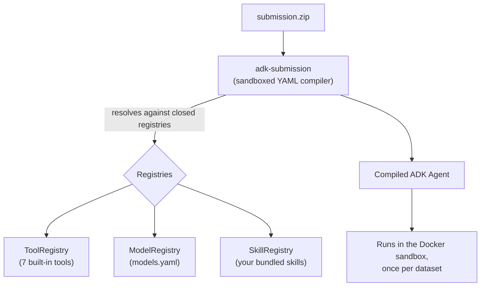

# 1. Competition Overview

## 1.1 What makes this competition unusual

In a normal Kaggle competition you train a model on your own machine and upload a **CSV of
predictions**. This competition is different — it is a **"Kaggle-in-Kaggle"** (internally nicknamed
`kaggle-kaggle`) *agent* competition:

- You upload a **program**, not predictions — specifically a declarative
  [Google ADK](https://google.github.io/adk-docs/) **agent** defined in YAML.
- Kaggle runs your agent **fully autonomously, with no human in the loop**, inside its own
  sandboxed evaluation harness.
- The agent must do the *entire* data-science job by itself: look at the data, clean it, engineer
  features, train models, submit predictions, and choose its best submission.

**What is being scored is the agent's autonomous decision-making**, not a model you trained offline.
The agent is run independently on **16 different tabular binary-classification datasets**, and the
final leaderboard number is the aggregate (mean) ROC AUC across them.

| Field | Value |
| :--- | :--- |
| Name | Autonomous Agent Prediction (Beta) |
| Slug | `autonomous-agent-prediction-beta` |
| Category | Playground |
| Reward | Swag (no cash) |
| Deadline | 2026-08-06 23:59 UTC |
| Metric | ROC AUC (higher is better) |
| Datasets | 16 tabular binary-classification folds (`train_01` … `train_16`) |
| Leaderboard top | ~0.830 (a tight cluster of 0.823–0.830) |

## 1.2 What you actually submit

A **zip archive** containing an ADK agent. The archive is compiled by a *sandboxed compiler* called
`adk-submission` — it is **not** a Python interpreter. It reads your YAML and wires up an agent from
**closed registries** of allowed tools, models, skills, and callbacks. Arbitrary code execution in
the YAML is forbidden.



### Mandatory archive layout

```
submission.zip
├── agent.yaml            # MUST be at the archive root
├── prompts/system.md     # system prompt (via !include)
├── configs/sampling.yaml # generation config (via !include)
└── skills/
    └── auto-ml/
        ├── SKILL.md       # skill manifest (name must be lowercase-kebab-case)
        └── scripts/
            └── run_pipeline.py
```

### Non-negotiable rules (violating any fails validation)

1. `agent.yaml` **must be at the archive root** — not in a subfolder.
2. **No symlinks** anywhere in the archive.
3. **No path traversal** (`../`) in `!include`/`config_path` — everything resolves inside the
   submission dir.
4. **No dynamic imports** in YAML — only the closed registries exist (anti-arbitrary-code).
5. **Max 10 bundled skills**, each with a `SKILL.md`. Skill directory names must be
   **lowercase kebab-case** (`auto-ml`, *not* `auto_ml`).
6. The requested **model must exist in `models.yaml`**.
7. The sandbox is **network-isolated** — no internet, no `pip install`, only the pre-baked libraries.
8. **Budget limits are hard limits** — exceeding time / tool-calls / submissions / USD spend
   terminates the session immediately.
9. **Never edit `sample_submission/`** — it is an immutable reference template. Each experiment gets
   its own `submissions/<name>/` directory.

## 1.3 The sandbox environment

The agent runs inside an offline Docker container: `gcr.io/kaggle-images/python` (~35 GB). It is the
standard Kaggle Python image, so it ships with a full data-science stack **pre-installed** — but
with **no internet and no ability to install packages**. Confirmed available and used by our
pipeline:

| Library | Version in the image |
| :--- | :--- |
| pandas | 2.3.3 |
| numpy | 2.0.2 |
| scikit-learn | 1.6.1 |
| lightgbm | 4.6.0 |
| xgboost | 3.2.0 |
| catboost | 1.2.10 |

(`torch`, `tensorflow`, `scipy`, etc. are also present.) The container's working directory contains
`train.csv`, `test.csv`, and `sample_submission.csv` — **and nothing else** (notably **no
`DATA.md`**; see [02-the-data.md](02-the-data.md)).

## 1.4 Budgets (per dataset)

Crucially, **each of the 16 datasets is an independent agent session with its own fresh budget** —
budgets are *not* shared across all 16. This means a full modeling pipeline per dataset is entirely
affordable. The local harness uses these defaults (the real competition values are injected by
Kaggle's backend at eval time and are similar in spirit):

| Budget | Local default | Meaning |
| :--- | :--- | :--- |
| `max_tool_calls` | 1000 | total tool invocations |
| `max_submissions` | 30 | public-LB submissions |
| `max_selections` | 2 | submissions chosen for private LB |
| `max_exec_seconds` | 3600 | timeout per command |
| `max_budget_usd` | $2.00 | LLM token spend |
| `max_llm_calls` | 1000 | LLM API calls |
| `max_time_minutes` | 60 | total wall-time |

For reference, our agent uses only **~6 LLM calls, 2 counted tool calls, and ~$0.01** per dataset —
a tiny fraction of any of these limits. See [03-evaluation-harness.md](03-evaluation-harness.md) for
why skill calls barely touch the tool budget.

## 1.5 The available LLMs (`models.yaml`)

Your agent's `model:` must be one alias from the competition's `models.yaml`. LLM inference during a
real Kaggle run is routed through **Kaggle's own proxy** and billed against the competition budget —
*not your own API key*. The registry spans Gemini, Claude, GPT-OSS, DeepSeek, Qwen, and Grok
families. A few relevant entries:

| Alias | Input $/1M | Output $/1M | Note |
| :--- | ---: | ---: | :--- |
| `gemini-2.5-flash-lite` | 0.10 | 0.40 | cheapest |
| `gemini-3.1-flash-lite` | 0.25 | 1.50 | **what our agent uses** |
| `gemini-3.5-flash` | 1.50 | 9.00 | used by the sample baseline |
| `gpt-oss-120b` | 0.09 | 0.36 | open model, hostable on Groq/NVIDIA for free local dev |
| `claude-opus-4-8` | 5.00 | 25.00 | most capable Claude |

Because our agent barely uses the LLM (the intelligence is in the deterministic skill), model choice
is almost irrelevant to cost — reliability of tool-calling is the only real factor. See
[06-agent-architecture.md](06-agent-architecture.md).
