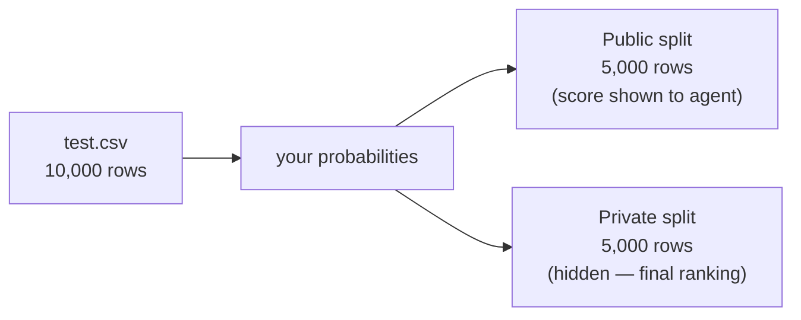

# 2. The Data

There are **16 separate datasets**, `data/train_01/` … `data/train_16/`. Each contains:

| File | Purpose |
| :--- | :--- |
| `train.csv` | training rows: `row_id`, features, `target` |
| `test.csv` | test rows: `row_id`, features (no target) |
| `sample_submission.csv` | correct output format: `row_id`, `target` |
| `solution.csv` | **ground-truth test labels** with a `Usage` column (Public/Private) |
| `DATA.md` | human-readable per-column type descriptions |

> **Two critical facts about these files:**
>
> 1. **`solution.csv` is present locally but NOT in the eval sandbox.** It is the answer key. We use
>    it *only* for offline development scoring (a huge advantage — see
>    [05-modeling-pipeline.md](05-modeling-pipeline.md)). The agent never sees it.
> 2. **`DATA.md` is also NOT in the sandbox.** The eval container only gets `train.csv`, `test.csv`,
>    `sample_submission.csv`. So the pipeline must **infer column types from the data itself** — it
>    cannot rely on DATA.md. (We use DATA.md offline only to *verify* our inference is correct.)

## 2.1 Deliberately varied schemas

The 16 datasets have intentionally different shapes — the competition is testing whether the agent's
pipeline **generalizes across schemas**, not whether it is tuned to one. Our survey of all 16:

| fold | n_train | n_feat | categorical | numeric-ish | notes |
| :--- | ---: | ---: | ---: | ---: | :--- |
| train_01 | 14,957 | 12 | 4 | 8 | mixed |
| train_02 | 14,929 | 28 | 1 | 27 | mostly numeric |
| train_03 | 3,501 | 18 | 6 | 12 | mixed |
| train_04 | 8,775 | 12 | 0 | 12 | all numeric |
| train_05 | 1,060 | 9 | 5 | 4 | small, mixed |
| train_06 | 10,803 | 9 | 9 | 0 | all categorical |
| train_07 | 10,417 | 17 | 2 | 15 | mixed |
| train_08 | 8,173 | 12 | 12 | 0 | all categorical |
| train_09 | 1,109 | 18 | 0 | 18 | small, numeric |
| train_10 | 11,800 | 27 | 0 | 27 | all numeric |
| train_11 | 28,879 | 20 | 0 | 20 | large, numeric |
| train_12 | 49,432 | 8 | 1 | 7 | largest |
| train_13 | 500 | 9 | 4 | 5 | **tiny** |
| train_14 | 11,108 | 23 | 4 | 19 | many ordinals |
| train_15 | 500 | 30 | 7 | 23 | **tiny + wide** |
| train_16 | 1,809 | 21 | 0 | 21 | all numeric |

Ranges: **n_train 500 → 49,432**, **n_features 8 → 30**. Test set is always **10,000 rows**.

## 2.2 Column types and how they are stored

`DATA.md` labels each feature as one of four types, but the important distinction for modeling is how
each is **stored in the CSV**:

| DATA.md type | Stored as | Example values | How we treat it |
| :--- | :--- | :--- | :--- |
| `categorical` | **string** | `cat_0`, `cat_1`, … | nominal → **one-hot encode** |
| `ordinal` | **string** | `ord_0`, `ord_1`, … | ordered → **ordinal-encode by the integer** |
| `numeric` | float | `7.29`, `-0.30` | keep as-is (NaN preserved) |
| `count` | integer | `0`, `5`, `28` | keep as-is (ordered) |

The clean rule we derived: **the only feature that needs nominal treatment is the string
`cat_*` column.** Everything else (`ord_*`, `numeric`, `count`) is meaningfully ordered and can be
treated numerically. Because the string values carry their own prefix (`cat_` vs `ord_`), our
pipeline can infer this from the data alone — no DATA.md needed.

> **A subtle gotcha we hit:** modern pandas (3.x on our dev box) reads these string columns as the
> new `str`/`StringDtype`, while the sandbox's pandas 2.3.3 reads them as `object`. Our type
> inference keys off `dtype.kind` and the string *values*, so it behaves identically under both — we
> verified this by running the pipeline inside the actual sandbox image.

## 2.3 Target and scoring split

- The **target** is always integer `{0, 1}` and **near-balanced** (positive rate 0.49–0.51 in every
  fold). There is no class-imbalance problem.
- Because the metric is ROC AUC and `submit_predictions` scores the `target` column directly with
  `roc_auc_score(y_true, y_pred)`, the submission's `target` must be a **positive-class probability**
  (a continuous score), **not** a hard 0/1 label.
- `solution.csv` splits the 10,000 test rows into **5,000 Public** and **5,000 Private** via its
  `Usage` column. The agent only ever sees the **Public** score during a run; the **Private** score
  is what counts for the final ranking.

## 2.4 Diagnostics — what we learned about signal

We ran several cheap diagnostics across all folds (`dev/` scripts) to understand where the achievable
performance lies:

| Diagnostic | Result | Implication |
| :--- | :--- | :--- |
| Row-order signal | AUC ≈ 0.50 everywhere | No leakage from `row_id` / ordering (ids are random hashes). |
| **Adversarial validation** (train vs test) | AUC ≈ 0.50 everywhere | **No covariate shift** — train and test come from the same distribution, so our cross-validation is a trustworthy estimate of test performance. |
| Best single-feature AUC | 0.57 – 0.77 | Some folds are largely univariate; others have strong multivariate signal our GBMs capture (e.g. train_02 goes from 0.62 single-feature to 0.97 modeled). |

The weak folds (**train_05, train_09, train_13** at ≈ 0.62–0.66) have very little signal beyond a
single feature and appear to be **near their Bayes ceiling** — they are hard by construction, not
because of a modeling mistake. Most improvement headroom is in the middle folds (e.g. train_01 at
0.71). This is why our strategy prioritizes **reliability across all 16** over squeezing any one — see
[04-strategy-and-decisions.md](04-strategy-and-decisions.md).
