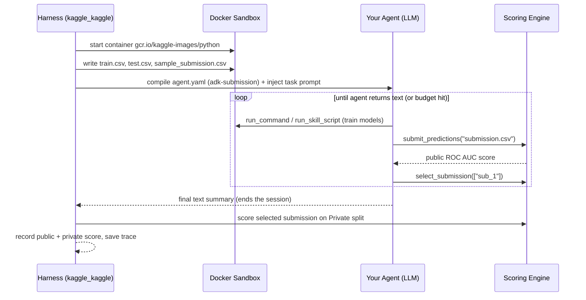
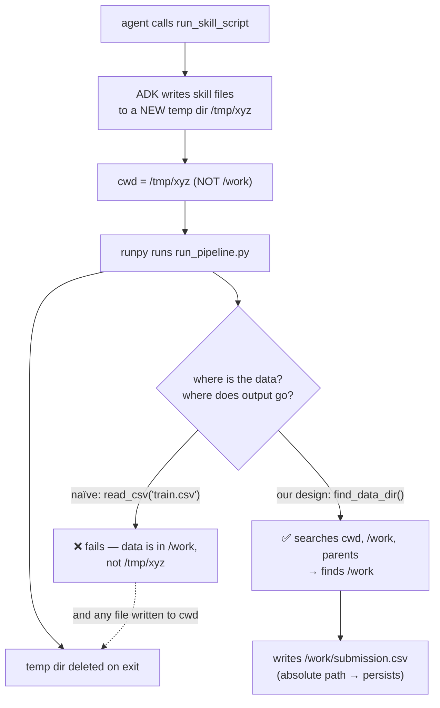

# 3. The Evaluation Harness

This document explains how Kaggle actually runs your agent — the tools it exposes, how scoring works,
and (importantly) the exact mechanics of how a **bundled skill script executes**. Much of this was
reverse-engineered from the `kaggle_kaggle` and `adk_submission` wheels and confirmed with local
runs; understanding it was essential to building an agent that works.

## 3.1 The lifecycle of one evaluation

For **each** dataset, the harness spins up a fresh session:



## 3.2 The tool set (7 tools)

The agent gets exactly these built-in tools (the planning doc originally listed 6 — `read_file` is a
7th):

| Tool | Signature | Purpose |
| :--- | :--- | :--- |
| `run_command` | `(command: str) -> str` | run a shell command in the sandbox |
| `read_file` | `(filepath, start_line?, end_line?) -> str` | read a file (truncated to 500 lines) |
| `write_file` | `(filepath, content) -> str` | create/overwrite a file |
| `edit_file` | `(filepath, old, new, allow_multiple?) -> str` | targeted text replacement |
| `submit_predictions` | `(filepath) -> str` | submit a CSV for public scoring |
| `select_submission` | `(submission_ids: list) -> str` | choose submissions for private scoring |
| `get_status` | `() -> str` | remaining budgets + submission history |

### `submit_predictions` validation

The CSV is rejected unless it exactly matches `sample_submission.csv`: same columns, same row count,
unique ids, and ids that match the test set. On success it returns the **public** score and the
submission id (`sub_1`, `sub_2`, …). The `target` column is scored directly by `roc_auc_score`, so it
**must contain probabilities**.

### `select_submission`

Chooses up to `max_selections` submissions for the private leaderboard. If you never call it, the
harness auto-selects your best public submission — so calling it on your best is always safe.

### Budget accounting — a key subtlety

Every kaggle-kaggle tool call (including `get_status`, `read_file`, `write_file`) increments the
tool-call counter and is checked against the time / tool / token budgets. **But the skill meta-tools
(next section) run through ADK, not through these wrappers — so they barely touch the tool budget.**
In our real run, a full fold used only **2 counted tool calls** (`submit_predictions` +
`select_submission`), even though it also loaded and executed a skill.

## 3.3 How a bundled skill executes (the important part)

Declaring `skills: [skills/auto-ml]` in `agent.yaml` does **not** add a single "run my skill" tool.
Instead ADK's `SkillToolset` gives the agent four **meta-tools** automatically (you do *not* list them
in `tools:`):

| Meta-tool | What it does |
| :--- | :--- |
| `list_skills` | list available skills + descriptions |
| `load_skill` | read a skill's `SKILL.md` instructions |
| `load_skill_resource` | view a file inside the skill (`scripts/…`, `references/…`) |
| `run_skill_script` | **execute** a script from the skill's `scripts/` directory |

### The temp-directory gotcha

When the agent calls `run_skill_script`, ADK does **not** run the script in the sandbox's working
directory (`/work`, where the data lives). It builds a wrapper that:

1. materializes the skill's files into a **fresh temporary directory**,
2. `chdir`s into that temp dir,
3. runs the script via `runpy`,
4. `chdir`s back and **deletes the temp dir**.



**Consequence:** a naïve skill that does `pd.read_csv("train.csv")` or writes `submission.csv` to the
current directory **fails silently** — the data isn't in the temp cwd, and any output vanishes when
the temp dir is cleaned. Our `run_pipeline.py` handles this with a `find_data_dir()` that searches
`cwd`, `/work`, and parent directories for the three CSVs, and writes its output by **absolute path**
into that directory so `submit_predictions("submission.csv")` can find it. See
[06-agent-architecture.md](06-agent-architecture.md).

## 3.4 Scoring internals

`submit_predictions` merges your prediction with `solution.csv` on `row_id`, then scores each `Usage`
split:

```python
public_score  = roc_auc_score(y_true[Usage=="Public"],  y_pred[Usage=="Public"])
private_score = roc_auc_score(y_true[Usage=="Private"], y_pred[Usage=="Private"])
```

Only `public_score` is returned to the agent. The `ProblemResult` records both, plus token usage,
tool calls, wall-time, and an `end_status` (`completed`, `timeout`, `budget_exceeded`,
`no_submissions`, `agent_error`). Traces are saved to `submissions/<name>/output/`.

## 3.5 Local vs. real evaluation

- **Local** (`run_local_eval.py`): runs one dataset per invocation, in your local Docker, using your
  own LLM key (Direct Provider Mode) or a proxy. Budgets are CLI defaults, **not** the competition's
  real values. Great for de-risking mechanics before spending a submission slot.
- **Real** (on Kaggle after `kaggle competitions submit`): runs on Kaggle's infrastructure, routes
  the LLM through **Kaggle's proxy** (billed to the competition, not you), and evaluates across the
  competition's datasets to produce the aggregate leaderboard score.

One Windows-only wrinkle: without `PYTHONUTF8=1`, `run_local_eval.py` finishes the run correctly but
then crashes trying to print an emoji (📌) to the cp1252 console. Cosmetic only — set `PYTHONUTF8=1`.
