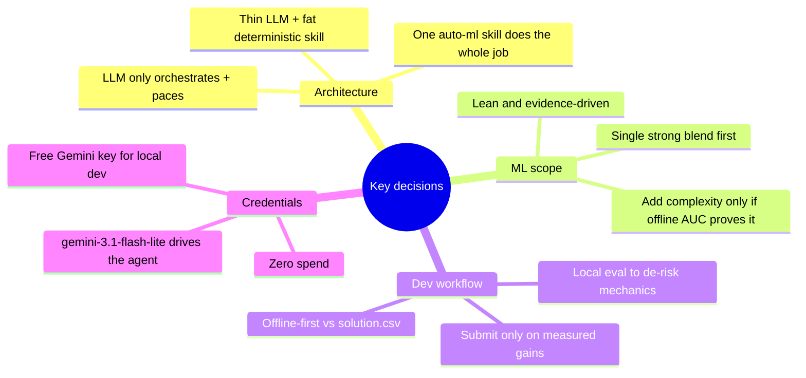

# 4. Strategy and Decisions

This document records the *reasoning* behind the solution — the strategic reads of the competition
and the decisions we committed to. The goal is that a future reader understands not just *what* we
built but *why*.

## 4.1 The four strategic reads

### 1. The leaderboard is tightly clustered → reliability beats brilliance

The top of the public leaderboard sits in a narrow band, **0.823–0.830**. With a single aggregate
score computed as the mean AUC across 16 folds, the math is asymmetric and unforgiving:

> If 13 folds score 0.83 but 3 folds crash / time out / blow the budget and score ~0.5, the mean is
> **(13·0.83 + 3·0.5) / 16 ≈ 0.77** — well off the bottom of the leaderboard.

The downside of *one* failed fold dwarfs the upside of a brilliant one. Therefore the dominant
objective is **"a competent gradient-boosted model on *every* fold, never crash, never overrun"** —
not "excellent on the easy folds." This shaped everything: we optimize for robustness across all 16
schemas, not peak performance on any one.

### 2. We have the answer key locally → develop offline, for free

Each fold ships `solution.csv` (the true test labels). It is absent from the eval sandbox, but for
**our own development** it is ground truth. That means the entire modeling pipeline can be built and
scored to a real holdout ROC AUC **with no LLM, no Docker, and no budget spend** — just
`python pipeline.py → score against solution.csv`. This is the fastest, cheapest possible iteration
loop, and it is where nearly all of our engineering effort goes.

### 3. Native categorical handling collapses the schema problem

The categorical columns are **low-cardinality** (max 8 distinct values, zero unseen categories in
test). That means the elaborate target/frequency-encoding machinery you'd normally reach for is
unnecessary — plain one-hot encoding (≤8 dummies per column) captures the signal cheaply and works
with any model. Combined with GBMs' native NaN handling, the "generalize across varied schemas"
challenge becomes almost trivial.

### 4. Put the intelligence in a deterministic skill; keep the LLM thin

Because the task is standardized (tabular binary classification, ROC AUC) and the budgets are finite,
the winning move is to bundle a **robust, pre-tested pipeline as a skill** and let the LLM merely
orchestrate it: run the skill → submit → select. This minimizes tokens, tool calls, and — most
importantly — **failure modes**. It is also robust to budget uncertainty: if budgets are tight, a
thin agent is the *only* thing that fits; if they're generous, it still wins.

## 4.2 The decisions (made jointly with the project owner)

| Decision | Choice | Rationale |
| :--- | :--- | :--- |
| Architecture | **Thin LLM + fat skill** | Most reliable, cheapest, robust to budget uncertainty. |
| ML scope | **Lean, evidence-driven** | Start with one strong blend; let offline scoring justify any added complexity. |
| Dev workflow | **Offline-first, then de-risk locally, then submit** | Exploit `solution.csv`; only spend a submission slot once mechanics are proven. |
| Agent LLM | **`gemini-3.1-flash-lite`** | Reliable tool-caller, free on Google AI Studio for local dev; model barely matters since the LLM does little. |
| Cost | **$0** | Local dev on free tier; real eval runs on Kaggle's budget. |

## 4.3 Why not a multi-agent / heavier design?

The competition *permits* `SequentialAgent`/`ParallelAgent`/`LoopAgent` and multiple sub-agents, and
it's tempting to build an elaborate "EDA agent → FE agent → modeling agent" pipeline. We deliberately
did **not**, because:

- Every extra LLM step is another chance to fail, more tokens, and more latency — directly at odds
  with strategic read #1 (reliability).
- The ROC-AUC score rewards *predictions*, not *how much the LLM reasoned*. A deterministic pipeline
  that reliably produces good predictions beats an "agentic" one that occasionally goes off the rails.
- The skills system exists precisely to bundle pre-tested code, so leaning on it is idiomatic, not a
  hack.

## 4.4 How the plan was validated

The strategy was confirmed empirically, in order:

1. Offline pipeline reaches a stable mean AUC across all 16 folds (~0.798).
2. The same pipeline, wrapped as a skill, reproduces those numbers **inside the real sandbox image**.
3. A full local eval shows the thin agent drives the workflow autonomously at ~$0.01/fold.
4. A real Kaggle submission scores **0.805**, matching the offline mean — **proving the offline loop
   is a faithful proxy for the leaderboard.**

That final point is the strategic payoff: we can now improve the model entirely offline and know the
gains will translate. See [08-results-and-roadmap.md](08-results-and-roadmap.md).
