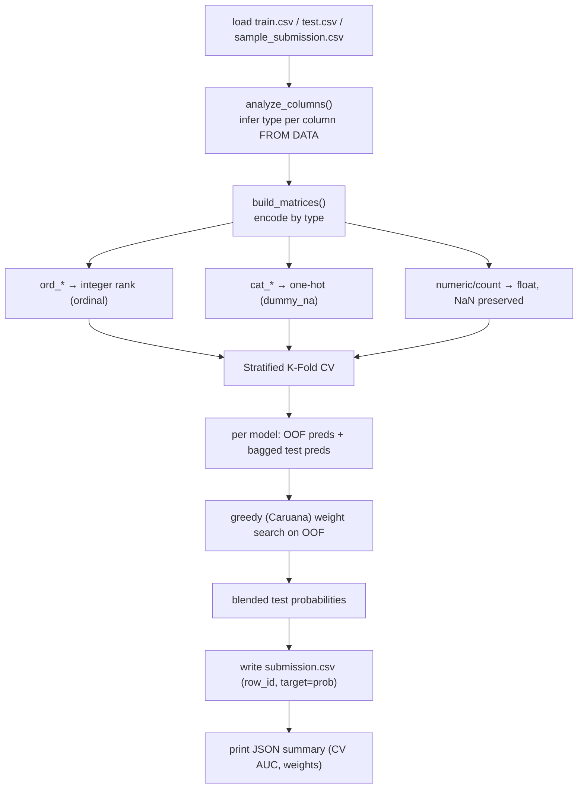

# 5. The Modeling Pipeline

This is the deterministic pipeline at the heart of the solution. It lives in two mirrored places:

- `dev/pipeline.py` — the **library form**, used by the offline dev loop (`dev/score_all_folds.py`,
  `dev/experiment.py`).
- `submissions/01_gbm_blend/agent/skills/auto-ml/scripts/run_pipeline.py` — the **deployed form**, a
  single self-contained script bundled into the agent (see [06-agent-architecture.md](06-agent-architecture.md)).

Both implement the same logic. The deployed script is self-contained and dependency-light so it runs
inside the sandbox using only pre-installed libraries.

## 5.1 End-to-end flow



## 5.2 Schema inference (no DATA.md at eval time)

Since `DATA.md` is absent in the sandbox, `analyze_columns()` classifies each feature from the data:

```python
def analyze_columns(train, feat_cols):
    kinds = {}
    for c in feat_cols:
        s = train[c]
        if s.dtype.kind in "iufb":          # int/uint/float/bool → numeric
            kinds[c] = "num"
        elif all values match r"ord_?\d+":   # e.g. 'ord_3' → ordinal
            kinds[c] = "ord"
        else:                                # e.g. 'cat_1', any other string → nominal
            kinds[c] = "cat"
    return kinds
```

We validated this inference against the local `DATA.md` labels: it achieves **100% recall on the
true categoricals in every fold**, with no false positives once ordinals are correctly routed to the
`ord` bucket. It also behaves identically under the sandbox's pandas 2.3.3 and our dev pandas 3.x.

## 5.3 Encoding

| Kind | Encoding | Why |
| :--- | :--- | :--- |
| `num` | pass through as `float32`, **NaN preserved** | GBMs handle missing values natively; imputation would only add noise. |
| `ord` | extract the trailing integer (`ord_3` → `3`) | preserves the natural order, which trees exploit efficiently. |
| `cat` | one-hot with `dummy_na=True` | low cardinality (≤8) makes one-hot cheap; the NaN dummy captures missingness. |

Encoding is fit on `train ∪ test` combined so the columns align, then split back — safe here because
there are **zero unseen test categories**.

## 5.4 Models and cross-validation

Three gradient boosters, chosen for their strong empirical track record on tabular data and native
NaN handling — all pre-installed in the sandbox:

| Model | Role |
| :--- | :--- |
| **LightGBM** | fast, strong baseline |
| **XGBoost** | diverse booster for the blend |
| **CatBoost** | **strongest single model** on this data |

For each model we run **Stratified 5-fold CV**, producing:

- **Out-of-fold (OOF) predictions** on train — an honest estimate used to choose blend weights.
- **Bagged test predictions** — averaged across the 5 fold-models, which is more stable than a single
  full-train refit.

The metric is computed as `roc_auc_score(y_true, positive_class_probability)` — we submit the
probability of the positive class (column 1 of `predict_proba`), never a hard label.

## 5.5 Blending — greedy (Caruana) weight selection

Rather than a fixed average, we pick per-fold blend weights with **Caruana forward selection with
replacement** on the cached OOF predictions:

1. Start from the single best model (by OOF AUC).
2. Repeatedly add whichever model most improves the OOF AUC of the running average.
3. Stop when no addition helps.

This is cheap (pure NumPy on cached arrays) and empirically beats both equal-weight blending and any
single model. On this data it often leans heavily on CatBoost while mixing in the others only where
they demonstrably help.

## 5.6 Experiment results (offline, scored vs `solution.csv`)

Mean AUC across all 16 folds. `full` = all 10k test rows; `private` = the 5k Private split (the ranking metric).

| Configuration | mean full AUC | mean private AUC | notes |
| :--- | ---: | ---: | :--- |
| single LightGBM (defaults) | 0.7917 | 0.7932 | first baseline |
| single CatBoost (defaults) | 0.7964 | — | best single model |
| equal blend (lgb+xgb+cat) | 0.7960 | 0.7973 | equal weights dilute CatBoost |
| **greedy blend (lgb+xgb+cat)** | **0.7982** | **0.7995** | **← currently deployed** |
| greedy blend + HistGradientBoosting | 0.7981 | 0.7994 | hgb adds nothing |

**What helped:** ordinal-encoding `ord_*` by their integer (vs one-hot); greedy weighting.
**What didn't:** adding HistGradientBoosting; CatBoost *native* categorical handling (marginal gain,
~40× slower — not worth it given max cardinality is only 8).

### Phase 1b (in progress) — closing the gap to the leaders

The deployed blend scored **0.805 on the real leaderboard**, matching the offline mean almost exactly
(see [08-results-and-roadmap.md](08-results-and-roadmap.md)). The leaders sit at ~0.830, so there is
a real ~0.025 gap. Current experiments (`dev/tune.py`) show **early stopping + lower learning rate +
more iterations** (e.g. LightGBM with native categoricals, `n_estimators=3000`, `lr=0.02`,
`early_stopping_rounds=150`) beats the fixed-600-iteration baseline on nearly every fold (+0.005 to
+0.019 per fold). The plan is to fold early stopping into all three boosters and re-blend, then
consider per-fold hyperparameter search — deploying only what demonstrably raises the offline mean.

## 5.7 Two load-bearing gotchas (baked into the code)

1. **ROC AUC needs probabilities, not labels.** `sklearn`'s `roc_auc_score` has no `pos_label`
   argument; we submit `predict_proba(...)[:, 1]` (positive-class probability). Since the target is
   already `{0,1}`, `classes_[1]` is the positive class.
2. **XGBoost label handling.** XGBoost's sklearn API historically required integer-encoded labels.
   Here the target is already integer `0/1`, so no wrapper is needed — but the pipeline never relies
   on `model.classes_` for column order (it uses `np.unique(y)`), which is the robust pattern.
