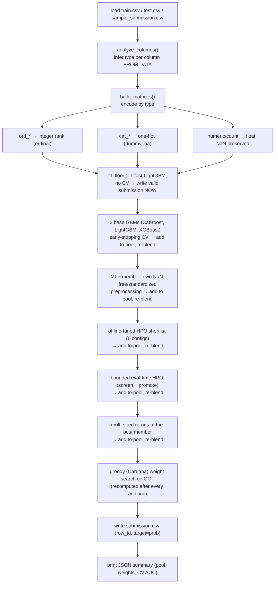

# 5. The Modeling Pipeline

This is the deterministic pipeline at the heart of the solution. It lives in two mirrored places:

- `dev/pipeline.py` — the **library form**, used by the offline dev loop (`dev/score_all_folds.py`,
  `dev/experiment.py`).
- `submissions/01_gbm_blend/agent/skills/auto-ml/scripts/run_pipeline.py` — the **deployed form**, a
  single self-contained script bundled into the agent (see [06-agent-architecture.md](06-agent-architecture.md)).

Both implement the same logic. The deployed script is self-contained and dependency-light so it runs
inside the sandbox using only pre-installed libraries.

## 5.1 End-to-end flow

The pipeline builds a **pool** of models incrementally and re-blends after every addition, rather
than training a fixed set and blending once — see §5.7 for why (the "anytime" design).



Every arrow after the floor is **time-budget-gated**: the step is skipped if a self-calibrating
estimate says it won't fit, so the pipeline degrades gracefully under any real per-command timeout
instead of ever failing to produce output. See §5.7 and [06-agent-architecture.md](06-agent-architecture.md).

## 5.2 Schema inference (no DATA.md at eval time)

Since `DATA.md` is absent in the sandbox, `analyze_columns()` classifies each feature from the data:

```python
def analyze_columns(train, feat_cols):
    kinds = {}
    for c in feat_cols:
        s = train[c]
        if s.dtype.kind in "iufb":          # int/uint/float/bool → numeric
            kinds[c] = "num"
        elif all values match r"ord_?\d+":   # e.g. 'ord_3' → ordinal
            kinds[c] = "ord"
        else:                                # e.g. 'cat_1', any other string → nominal
            kinds[c] = "cat"
    return kinds
```

We validated this inference against the local `DATA.md` labels: it achieves **100% recall on the
true categoricals in every fold**, with no false positives once ordinals are correctly routed to the
`ord` bucket. It also behaves identically under the sandbox's pandas 2.3.3 and our dev pandas 3.x.

## 5.3 Encoding

| Kind | Encoding | Why |
| :--- | :--- | :--- |
| `num` | pass through as `float32`, **NaN preserved** | GBMs handle missing values natively; imputation would only add noise. |
| `ord` | extract the trailing integer (`ord_3` → `3`) | preserves the natural order, which trees exploit efficiently. |
| `cat` | one-hot with `dummy_na=True` | low cardinality (≤8) makes one-hot cheap; the NaN dummy captures missingness. |

Encoding is fit on `train ∪ test` combined so the columns align, then split back — safe here because
there are **zero unseen test categories**.

## 5.4 Models and cross-validation

Three gradient boosters, chosen for their strong empirical track record on tabular data and native
NaN handling, plus a small PyTorch MLP added later as a structurally different model family (§5.6) —
all pre-installed in the sandbox:

| Model | Role |
| :--- | :--- |
| **LightGBM** | fast, strong baseline |
| **XGBoost** | diverse booster for the blend |
| **CatBoost** | **strongest single GBM** on this data |
| **MLP** (PyTorch) | structurally different — errors decorrelated from the GBMs; own preprocessing |

For each model we run **Stratified 5-fold CV** (3-fold on datasets over 20,000 rows, to bound
per-member cost), producing:

- **Out-of-fold (OOF) predictions** on train — an honest estimate used to choose blend weights.
- **Bagged test predictions** — averaged across the 5 fold-models, which is more stable than a single
  full-train refit.

The metric is computed as `roc_auc_score(y_true, positive_class_probability)` — we submit the
probability of the positive class (column 1 of `predict_proba`), never a hard label.

## 5.5 Blending — greedy (Caruana) weight selection

Rather than a fixed average, we pick per-fold blend weights with **Caruana forward selection with
replacement** on the cached OOF predictions:

1. Start from the single best model (by OOF AUC).
2. Repeatedly add whichever model most improves the OOF AUC of the running average.
3. Stop when no addition helps.

This is cheap (pure NumPy on cached arrays) and empirically beats both equal-weight blending and any
single model. On this data it often leans heavily on CatBoost while mixing in the others only where
they demonstrably help.

## 5.6 Experiment results (offline, scored vs `solution.csv`)

Mean AUC across all 16 folds. `full` = all 10k test rows; `private` = the 5k Private split (the ranking metric).

| Configuration | mean full AUC | mean private AUC | verdict |
| :--- | ---: | ---: | :--- |
| single LightGBM (defaults) | 0.7917 | 0.7932 | first baseline |
| single CatBoost (defaults) | 0.7964 | — | best single GBM |
| greedy blend (lgb+xgb+cat, defaults) | 0.7982 | 0.7995 | v1 deployed (LB 0.805) |
| + early stopping / lower LR / more iters | 0.8025 | 0.8037 | v2 deployed (LB 0.809) — **biggest single GBM lever** |
| + offline HPO shortlist + eval-time HPO + multi-seed | 0.8031 | 0.8038 | marginal (+0.0006) — GBM tuning saturated |
| + stacking meta-learner (replace greedy blend) | ≈ same to worse | **rejected** — no better than greedy, GBM-meta overfits |
| + feature engineering (missingness/rank aggregates) | 0.7988 (**-0.0020**) | | **rejected** — actively hurts, dilutes GBM iteration budget |
| **+ MLP as a 4th blend member** | **0.8049** | **0.8056** | v3 deployed (**LB 0.815**) — biggest single lever this round |

**What helped:** ordinal-encoding `ord_*` by their integer; greedy weighting; early stopping (the
single biggest GBM-side lever); **adding a structurally different model family** (MLP) — this beat
every amount of *more* GBM tuning/bagging by a wide margin (+0.0026-0.0029 vs +0.0006).
**What didn't:** HistGradientBoosting; CatBoost *native* categoricals (marginal, ~40× slower); a
stacking meta-learner; hand-crafted aggregate features (actively harmful — GBMs already exploit
per-column missingness/combinations via sequential splits, so explicit aggregates just add noise).

## 5.7 The anytime member-pool design

Because the real per-command sandbox timeout is never disclosed to the agent, the pipeline is built
to be safe under *any* time budget rather than assuming a fixed one:

- **Reliability floor**: `fit_floor()` — one fast LightGBM fit (no CV, ~150 trees) on the full
  training set — runs first and writes a valid `submission.csv` within about a second (or ~11s on
  the real, slower sandbox hardware — still far below any plausible timeout). Everything after this
  point only *improves* on an already-valid submission.
- **`TimeBudget`**: tracks a wall-clock budget (default 200s, overridable — see
  [06-agent-architecture.md](06-agent-architecture.md)) with a *self-calibrating* cost estimate per
  `(model, n_splits, max_iters)` shape: a heuristic guess is used before any real observation exists,
  then replaced by the actual measured time for the rest of the run. Each step checks
  `can_afford(...)` before starting and is skipped (not aborted mid-fit) if insufficient time remains.
- **Priority order** (highest validated value first): floor → 3 base GBMs → **MLP** → offline-tuned
  HPO shortlist → bounded eval-time HPO (cheap-screen random trials, promote only if competitive) →
  multi-seed reruns of the current best member. The blend is recomputed and the submission rewritten
  after every single addition.

Two real bugs were found and fixed while building and de-risking this design — both are about a
cost estimate being wrongly *shared* across things that shouldn't share it (across different models,
and across different model *families*). Full STAR-format write-ups are in
[`GOTCHAS.md`](../GOTCHAS.md) at the repo root:

1. Estimating cost per `(n_splits, max_iters)` only (not also per model) let one slow booster's
   observed time wrongly block a faster, unrelated booster from even being tried.
2. Reusing the GBM cost formula for the MLP (epochs ≠ boosting rounds) underestimated its true cost
   by roughly 100×, causing a real 24% time-budget overshoot in the Docker sandbox until fixed with
   an MLP-specific, deliberately conservative estimate.

## 5.8 Two load-bearing gotchas (baked into the code)

1. **ROC AUC needs probabilities, not labels.** `sklearn`'s `roc_auc_score` has no `pos_label`
   argument; we submit `predict_proba(...)[:, 1]` (positive-class probability). Since the target is
   already `{0,1}`, `classes_[1]` is the positive class.
2. **XGBoost label handling.** XGBoost's sklearn API historically required integer-encoded labels.
   Here the target is already integer `0/1`, so no wrapper is needed — but the pipeline never relies
   on `model.classes_` for column order (it uses `np.unique(y)`), which is the robust pattern.
