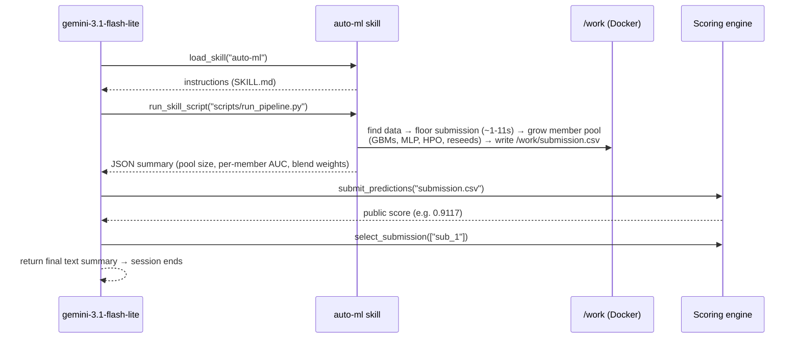

# 6. Agent Architecture

The agent is deliberately **thin**: its only job is to run the deterministic `auto-ml` skill, submit
the result, and select it. All the intelligence lives in the skill — an anytime member-pool pipeline
that blends LightGBM, XGBoost, CatBoost, and a small PyTorch MLP (see
[05-modeling-pipeline.md](05-modeling-pipeline.md)). This design directly serves the
reliability-first strategy — fewer LLM steps means fewer ways to fail, and the skill itself is
engineered to never fail to produce a submission regardless of the real (undisclosed) sandbox time
limit.

## 6.1 The pieces

```
submissions/01_gbm_blend/agent/
├── agent.yaml                     # agent definition
├── prompts/system.md              # system prompt (thin orchestration script)
├── configs/sampling.yaml          # generation config (temperature, thinking budget)
└── skills/auto-ml/
    ├── SKILL.md                   # skill manifest + instructions to the LLM
    └── scripts/run_pipeline.py    # the deterministic pipeline
```

### `agent.yaml`

```yaml
name: gbm_blend_agent
description: Autonomous tabular ML agent that runs a bundled GBM-blend skill and submits.
model: gemini-3.1-flash-lite        # any models.yaml alias; the LLM does very little
instruction: !include prompts/system.md
tools:
  - run_command                     # fallback for error recovery
  - read_file
  - write_file
  - submit_predictions
  - select_submission
  - get_status
skills:
  - skills/auto-ml                  # adds the 4 skill meta-tools automatically
generate_content_config: !include configs/sampling.yaml
```

Note we do **not** list `run_skill_script` etc. in `tools:` — declaring `skills:` adds those four
meta-tools automatically via ADK's `SkillToolset`.

## 6.2 What the agent does at runtime



This is exactly what happened in our real local runs — see the measured efficiency below.

## 6.3 The system prompt (thin orchestration)

`prompts/system.md` is intentionally directive. Its structure:

1. **Persona & goal** — expert autonomous data scientist optimizing ROC AUC; submit probabilities.
2. **Environment & budget** — offline sandbox, pre-installed libs, "don't waste budget exploring."
3. **A numbered plan** — the exact 4 steps: run the skill → submit → select → return a text summary.
   The skill's own internal time budget defaults to a safe 200s; the prompt tells the agent it does
   **not** need to compute or pass anything, but *may* optionally pass a larger
   `run_skill_script(..., args={"time-budget": 400})` if it's confident the session has headroom —
   this keeps the safety-critical default off the LLM's critical path while still allowing a more
   generous run when useful.
4. **Rules & error handling** — call `get_status` sparingly (it costs a tool call); if the skill
   fails, fall back to a short CatBoost/LightGBM script via `write_file` + `run_command`.

The prompt uses harness-injected placeholders like `{problem_description}`, `{metric_name}`,
`{max_time_minutes}`, `{max_submissions}` which the harness fills from `session.state`.

## 6.4 The skill script's robustness features

`run_pipeline.py` is engineered for the sandbox's quirks (see
[03-evaluation-harness.md](03-evaluation-harness.md)):

- **`find_data_dir()`** — locates the 3 CSVs by searching `cwd`, `/work`, and parent directories,
  because `run_skill_script` executes in an ephemeral temp cwd, not `/work`.
- **Absolute output path** — writes `submission.csv` into the located data dir (i.e. `/work`) so it
  persists after the temp dir is cleaned and `submit_predictions("submission.csv")` can read it.
- **Self-contained** — no imports beyond pandas/numpy/sklearn/lightgbm/xgboost/catboost/torch, all
  pre-installed. Prints a single compact JSON line (never raw dataframes) to protect the token budget;
  per-member progress goes to stderr instead, which the harness only surfaces to the LLM on failure.
- **Binary-target agnostic** — derives the positive class from `np.sort(unique(y))[1]`.
- **Anytime-safe under any time limit** — see [05-modeling-pipeline.md §5.7](05-modeling-pipeline.md#57-the-anytime-member-pool-design).
  Verified directly in the real Docker sandbox: an 8s budget on the largest fold (49,432 rows) still
  produces a complete, correctly-formatted submission (floor model only, ~11s including container
  overhead); a 200s budget lets most of the pool (base GBMs, MLP, HPO shortlist) complete.

## 6.5 Measured behavior (real local eval)

Running the full agent (with the MLP-integrated pipeline) in the actual sandbox:

| Fold | Public AUC | Private AUC | LLM calls | Est. cost | Counted tool calls | Wall time |
| :--- | ---: | ---: | ---: | ---: | ---: | ---: |
| train_16 (all-numeric) | 0.9117 | — | 6 | ~$0.01 | 2 | ~220s |
| train_01 (mixed) | 0.7162 | 0.7107 | 6 | $0.0062 | 2 | ~250s |

The scores match the offline pipeline closely, confirming the agent faithfully executes the skill.
Only `submit_predictions` and `select_submission` counted against the 1000-tool budget — the skill
meta-tools did not. Cost is negligible, so **model choice is driven by tool-calling reliability, not
price**; `gemini-3.1-flash-lite` drives the sequence cleanly.

**Real Kaggle submission history** (see [08-results-and-roadmap.md](08-results-and-roadmap.md) for
the full story): v1 (untuned 3-GBM blend) → public **0.805**; v2 (early-stopping tuned) → public
**0.809**; v3 (+ MLP blend member, this architecture) → public **0.815**.

## 6.6 Why the LLM still matters (a little)

Even in a thin design, the LLM provides value the deterministic script can't:

- **Error recovery** — if the skill errors (e.g. an unexpected schema), the prompt instructs a
  fallback path.
- **Budget pacing** — `get_status` lets it stop before hitting limits.
- **Orchestration** — sequencing skill → submit → select and terminating cleanly.

But by design these are lightweight, so the agent is cheap, fast, and hard to derail.
