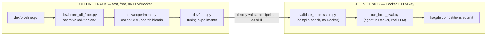

# 7. Development Workflow

This document is the practical, reproducible guide: how the project is set up, how to iterate on the
model, how to test the agent locally, and how to submit. It is the "how to actually run everything"
reference.

## 7.1 The two-track workflow

We deliberately separate **offline model development** (fast, free, no LLM) from **agent/harness
work** (slower, needs Docker + an LLM key). The offline track carries the modeling to a strong,
validated score first; the agent track then just wraps it and proves the mechanics.



## 7.2 Environment setup

Two virtual environments, by design:

| Env | Purpose | Contents |
| :--- | :--- | :--- |
| `.venv` | run the harness (`validate_submission.py`, `run_local_eval.py`) | `adk_submission`, `kaggle_kaggle` (from `wheels/`), `litellm`, `google-adk`, pandas/numpy/sklearn |
| `.venv-dev` | offline modeling (`dev/*.py`) | pandas, numpy, scikit-learn, lightgbm, xgboost, catboost, optuna |

```bash
# harness env — note the --prerelease=allow (google-adk pulls a pre-release transitive dep)
uv venv .venv --python 3.13
uv pip install --python .venv --prerelease=allow -r requirements.txt

# offline dev env
uv venv .venv-dev --python 3.13
uv pip install --python .venv-dev pandas numpy scikit-learn lightgbm catboost xgboost optuna
```

Other prerequisites:

- **Docker Desktop** running, with the sandbox image pulled: `docker pull gcr.io/kaggle-images/python`
  (~35 GB, one-time).
- **An LLM API key** for local eval, in `.env`. We use a free Google AI Studio key:
  `GEMINI_API_KEY=…`. (The `.env` is git-ignored.)
- **Kaggle CLI** authenticated (`~/.kaggle/kaggle.json`), competition rules accepted.

> **Model availability note:** a *new* free Gemini key cannot call the deprecated `gemini-2.5-*`
> models (404), so the agent uses `gemini-3.1-flash-lite`, which is confirmed working and is a valid
> `models.yaml` alias.

## 7.3 Offline modeling loop (the main loop)

This is where almost all iteration happens. It needs neither Docker nor an LLM, and costs nothing.

```bash
cd dev

# score the current pipeline on all 16 folds vs solution.csv
../.venv-dev/Scripts/python.exe score_all_folds.py --models lightgbm,xgboost,catboost

# cache per-model OOF/test arrays once, then search blends cheaply
../.venv-dev/Scripts/python.exe experiment.py build  --models lightgbm,xgboost,catboost
../.venv-dev/Scripts/python.exe experiment.py greedy --models lightgbm,xgboost,catboost

# run a tuning experiment (Phase 1b)
../.venv-dev/Scripts/python.exe tune.py --variant lgb_native_es
```

The north-star metric is the **mean full/private AUC across all 16 folds**, printed at the bottom of
each run. Because of the calibration result (§8), this number predicts the leaderboard.

## 7.4 Validate the agent (no Docker)

```bash
.venv/Scripts/python.exe validate_submission.py --agent-dir submissions/01_gbm_blend/agent
```

Checks YAML syntax, `!include` resolution, that the model is in `models.yaml`, and does a **dry-run
compile** of the ADK agent (catching skill-name/format errors) — all without Docker.

## 7.5 Run the agent locally (Docker + LLM)

```powershell
$env:PYTHONUTF8=1     # avoid the Windows emoji-encoding crash on the final print
.venv\Scripts\python.exe run_local_eval.py `
    --submission-dir submissions/01_gbm_blend/agent `
    --dataset train_01 --metric roc_auc
```

This spins up the sandbox container, compiles and runs the agent with your real LLM key, and prints a
live trace + a budget/score panel. Traces are saved to `submissions/01_gbm_blend/output/`.
Recommended smoke tests: one mixed fold (`train_01`), one all-categorical (`train_08`), one
all-numeric (`train_16`).

## 7.6 Package and submit

```powershell
# package: agent.yaml MUST be at the archive root, forward-slash paths, no symlinks
cd submissions/01_gbm_blend
# (we use .NET ZipFile.CreateFromDirectory for correct root layout on Windows)

# submit
kaggle competitions submit autonomous-agent-prediction-beta -f submission.zip -m "message"

# check status / score
kaggle competitions submissions autonomous-agent-prediction-beta
```

A submission runs the agent on Kaggle's infrastructure across the competition's datasets. It shows
`PENDING` while the agent executes (can take a while — it's running the full agent per dataset), then
resolves to a public score. **The LLM cost is billed to the competition, not to you.**

## 7.7 Quick command reference

| Task | Command |
| :--- | :--- |
| Score pipeline offline | `.venv-dev/Scripts/python.exe dev/score_all_folds.py --models lightgbm,xgboost,catboost` |
| Blend search | `.venv-dev/Scripts/python.exe dev/experiment.py greedy --models lightgbm,xgboost,catboost` |
| Validate agent | `.venv/Scripts/python.exe validate_submission.py --agent-dir submissions/01_gbm_blend/agent` |
| Local eval | `$env:PYTHONUTF8=1; .venv/Scripts/python.exe run_local_eval.py --submission-dir submissions/01_gbm_blend/agent --dataset train_01` |
| Submit | `kaggle competitions submit autonomous-agent-prediction-beta -f submissions/01_gbm_blend/submission.zip -m "..."` |
| Leaderboard | `kaggle competitions leaderboard autonomous-agent-prediction-beta -s` |
