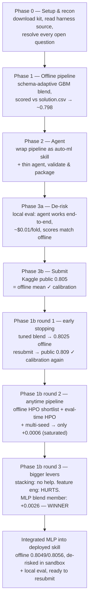

# 8. Results and Roadmap

## 8.1 Timeline of what we did

## 8.2 The headline result: offline ↔ leaderboard calibration

| Metric | Offline (mean vs `solution.csv`) | Real Kaggle leaderboard |
| :--- | ---: | ---: |
| v1 — untuned greedy 3-GBM blend | ~0.798 | **0.805** |
| v2 — tuned (early stopping) greedy blend | ~0.8025 (+0.0043) | **0.809** (+0.004) |
| v3 — GBM pool + MLP blend member | ~0.8049 (+0.0024) | **0.815** (+0.006 — exceeded the offline prediction) |

The offline mean and the real leaderboard score agree closely — **three submissions in a row**. The
v1→v2 offline improvement (+0.0043) predicted the v1→v2 leaderboard improvement (+0.004) almost to the
decimal. v2→v3's real gain (+0.006) came in *larger* than the offline-measured +0.0024 — plausibly
because the real sandbox allows more time than the 200s budget used for offline validation, letting
more pool members (including the MLP) fit during the actual evaluation. This confirms:

1. **The leaderboard aggregate is (essentially) the mean AUC across the folds.**
2. **Our offline `solution.csv` scoring is a faithful, free proxy for the leaderboard.**

The strategic consequence is large: **we can iterate the model entirely offline and trust that gains
transfer** — no LLM cost, no Docker, and no submission slots spent until we have a measured
improvement. This is the single most valuable thing we established.

## 8.3 Where we stand vs. the field

- Deployed agent: **public 0.815** (v3, GBM pool + MLP blend member).
- Leaderboard top-10 cluster: **0.824–0.830**.
- Gap to #1: **~0.015** (down from ~0.021 at v2), confirmed across three submissions to be a
  **real, closable modeling gap** (not an aggregation artifact), addressable with better modeling —
  and closing faster once a genuinely different model family entered the blend.

Per-fold, the achievable ceiling varies a lot: some folds are near-random by construction
(train_05/09/13 ≈ 0.62–0.66) and cannot be improved much, while others carry strong signal
(train_02 ≈ 0.97, train_16 ≈ 0.90). Improvement effort is best spent on the mid-range folds.

## 8.4 What's working and what isn't (evidence so far)

| Lever | Effect on offline mean | Verdict |
| :--- | :--- | :--- |
| Ordinal-encode `ord_*` by integer | small, consistent + | **adopted** |
| Greedy (Caruana) blend weights | +0.002 over best single, +0.002 over equal blend | **adopted** |
| HistGradientBoosting in the blend | ~0 | dropped |
| CatBoost *native* categoricals | marginal +, ~40× slower | rejected (cardinality only 8) |
| Early stopping + lower LR + more iters | 0.798 → 0.8025 (+0.0043) | **adopted** (v2) |
| Offline HPO shortlist (diverse configs) + eval-time HPO + multi-seed bagging | 0.8025 → 0.8031 (+0.0006) — saturated | adopted (marginal), see §8.5 |
| Stacking meta-learner (replace greedy blend) | ≈ 0 (logreg) to **negative** (GBM meta-learner overfits) | **rejected** |
| Feature engineering (missingness count, rank-normalized aggregates) | **-0.0020**, hurts on 14/16 folds | **rejected** |
| **MLP as a 4th blend member** (structurally different model family) | **+0.0026 to +0.0029**, survives combination with full GBM pool | **adopted** (v3) |

The clearest lesson from this round: **more tuning within the same model family (GBMs) saturates
fast** (+0.0006 from a lot of engineering effort), while **a genuinely different model family**
(a small PyTorch MLP) **delivered ~4x the gain** because its errors are less correlated with the
GBMs'. Two "seemingly reasonable" ideas — stacking and hand-crafted aggregate features — were tested
rigorously and both came back negative; see [`GOTCHAS.md`](../GOTCHAS.md) at the repo root for two
real bugs found and fixed while building and de-risking the MLP integration.

## 8.5 Roadmap — what was tried, in order

1. **Tuned blend (v2, adopted).** Early stopping + tuned learning rate/iterations on all three
   boosters, greedy-blended. 0.798 → 0.8025 offline, confirmed on the leaderboard (0.805 → 0.809).
2. **Anytime member-pool pipeline (adopted, marginal gain).** An offline-tuned diverse-config
   shortlist (`dev/hpo.py`), a bounded eval-time random search, and multi-seed reruns of the best
   member — all wrapped in a self-calibrating time budget so a valid submission always exists within
   ~1 second and only improves from there (see [06-agent-architecture.md](06-agent-architecture.md)).
   Real engineering value (reliability, budget-safety) but only +0.0006 offline AUC — GBM
   hyperparameter diversity had saturated.
3. **Stacking meta-learner (rejected).** Tested with cached OOF arrays (near-zero cost) — no better
   than greedy blending, sometimes worse.
4. **Feature engineering (rejected).** Row-wise missingness/rank-aggregate features actively hurt
   GBM performance — they're redundant with what trees already exploit via sequential splits, and
   just dilute the model's limited iteration budget with noise.
5. **MLP blend member (adopted, biggest win).** A small PyTorch MLP (own NaN-free/standardized
   preprocessing, strong regularization) added as a pool member. +0.0026–0.0029 offline, confirmed to
   survive combination with the full GBM pool, confirmed in the real Docker sandbox and via local
   agent eval. Current best offline: **0.8049 full / 0.8056 private**.

Each improvement is a change to the **skill's `run_pipeline.py` only** — the thin agent stays
untouched. After a redeploy we re-validate (`validate_submission.py`), re-run local eval, and submit
once, comparing the new leaderboard number to the offline prediction.

## 8.6 Operating principles going forward

- **Reliability first.** Never ship a pipeline that can crash or time out on a fold; a robust 0.80
  beats a fragile 0.83-on-some-folds.
- **Measure before deploying.** Offline mean AUC is the gate; the leaderboard is confirmation, not
  exploration.
- **Keep the agent thin.** All intelligence stays in the deterministic skill.
- **Spend nothing.** Local dev on the free tier; real eval on Kaggle's budget.

## 8.7 Known risks / open items

- **Real competition budgets are still unknown** — local eval uses CLI defaults, and Kaggle injects
  the true per-fold budgets only during a real run. Our agent's usage (~$0.01, ~6 LLM calls, 2 tool
  calls per fold) is so far below any plausible limit that this is low-risk.
- **Free-tier rate limits** (not cost) could throttle local eval if we run many folds quickly; we
  pace runs one at a time.
- **The 0.025 gap** may require more than GBM tuning if the leaders use fundamentally different
  methods; the roadmap escalates from cheap tuning to more diverse ensembling accordingly.
