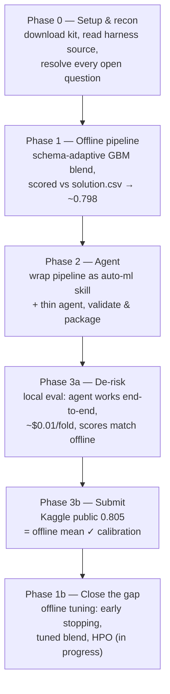

# 8. Results and Roadmap

## 8.1 Timeline of what we did

## 8.2 The headline result: offline ↔ leaderboard calibration

| Metric | Offline (mean vs `solution.csv`) | Real Kaggle leaderboard |
| :--- | ---: | ---: |
| Deployed greedy 3-GBM blend | ~0.798–0.805 | **0.805** |

The offline mean and the real leaderboard score agree almost exactly. This confirms:

1. **The leaderboard aggregate is (essentially) the mean AUC across the folds.**
2. **Our offline `solution.csv` scoring is a faithful, free proxy for the leaderboard.**

The strategic consequence is large: **we can iterate the model entirely offline and trust that gains
transfer** — no LLM cost, no Docker, and no submission slots spent until we have a measured
improvement. This is the single most valuable thing we established.

## 8.3 Where we stand vs. the field

- Deployed agent: **public 0.805**.
- Leaderboard top: **0.830** (tight cluster 0.823–0.830).
- Gap: **~0.025**, now known to be a **real modeling gap** (not an aggregation artifact), so it is
  addressable with better offline modeling.

Per-fold, the achievable ceiling varies a lot: some folds are near-random by construction
(train_05/09/13 ≈ 0.62–0.66) and cannot be improved much, while others carry strong signal
(train_02 ≈ 0.97, train_16 ≈ 0.90). Improvement effort is best spent on the mid-range folds.

## 8.4 What's working and what isn't (evidence so far)

| Lever | Effect on offline mean | Verdict |
| :--- | :--- | :--- |
| Ordinal-encode `ord_*` by integer | small, consistent + | **adopted** |
| Greedy (Caruana) blend weights | +0.002 over best single, +0.002 over equal blend | **adopted** |
| HistGradientBoosting in the blend | ~0 | dropped |
| CatBoost *native* categoricals | marginal +, ~40× slower | rejected (cardinality only 8) |
| **Early stopping + lower LR + more iters** | single tuned LightGBM ≈ 0.798 (matches the whole untuned blend); +0.005 to +0.019 on most folds | **promising — being folded in** |

## 8.5 Roadmap to close the gap

Ordered by expected value, all validated **offline first**, redeploying the skill only when the mean
demonstrably rises:

1. **Tuned blend (in progress).** Apply early stopping + tuned learning rate/iterations to all three
   boosters, then greedy-blend. Early evidence: a single tuned LightGBM already matches the untuned
   3-model blend, and different tuned models win on different folds — so the tuned blend should clear
   0.80.
2. **More CV folds + multi-seed bagging.** Cheap variance reduction on the bagged test predictions,
   especially helpful on the small folds.
3. **Per-fold hyperparameter search.** A bounded random search over validated ranges (no `optuna`
   dependency required — implementable with sklearn/numpy for sandbox safety), tuning the strongest
   model per fold.
4. **Additional model family** (e.g. a small neural net / tabular model) blended in, *if* offline
   evidence justifies the extra sandbox runtime — the 0.83 leaders may be using more diverse
   ensembles.

Each improvement is a change to the **skill's `run_pipeline.py` only** — the thin agent stays
untouched. After a redeploy we re-validate (`validate_submission.py`), optionally re-run local eval,
and submit once, comparing the new leaderboard number to the offline prediction.

## 8.6 Operating principles going forward

- **Reliability first.** Never ship a pipeline that can crash or time out on a fold; a robust 0.80
  beats a fragile 0.83-on-some-folds.
- **Measure before deploying.** Offline mean AUC is the gate; the leaderboard is confirmation, not
  exploration.
- **Keep the agent thin.** All intelligence stays in the deterministic skill.
- **Spend nothing.** Local dev on the free tier; real eval on Kaggle's budget.

## 8.7 Known risks / open items

- **Real competition budgets are still unknown** — local eval uses CLI defaults, and Kaggle injects
  the true per-fold budgets only during a real run. Our agent's usage (~$0.01, ~6 LLM calls, 2 tool
  calls per fold) is so far below any plausible limit that this is low-risk.
- **Free-tier rate limits** (not cost) could throttle local eval if we run many folds quickly; we
  pace runs one at a time.
- **The 0.025 gap** may require more than GBM tuning if the leaders use fundamentally different
  methods; the roadmap escalates from cheap tuning to more diverse ensembling accordingly.
