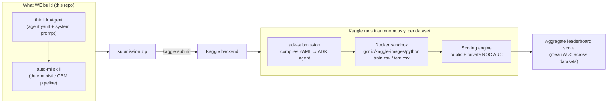

# Autonomous Agent Prediction (Beta) — Project Documentation

This folder documents both the **competition** and **our solution** in depth. If you read it
top to bottom you will understand what the competition is, how it is evaluated, how our agent and
modeling pipeline work, why we made the choices we did, and how to reproduce and extend everything.

> **One-line summary.** This is a *"Kaggle-in-Kaggle"* competition: instead of uploading a CSV of
> predictions, we upload a small **autonomous AI agent** that Kaggle runs — with no human in the
> loop — inside a locked-down sandbox, where it must explore data, train models, and submit
> predictions for **16 tabular binary-classification datasets**, scored on **ROC AUC**.

---

## Current status (living summary)

| Item | Value |
| :--- | :--- |
| Competition | [Autonomous Agent Prediction (Beta)](https://www.kaggle.com/competitions/autonomous-agent-prediction-beta) |
| Deadline | **2026-08-06 23:59 UTC** |
| Metric | ROC AUC (higher is better) |
| Our approach | Thin LLM agent + one deterministic **`auto-ml` skill** (greedy LightGBM+XGBoost+CatBoost blend) |
| Offline mean AUC (16 folds) | **~0.798** (greedy blend) |
| First Kaggle submission | **public 0.805** — calibration with offline is near-perfect |
| Leaderboard top | 0.830 (cluster 0.823–0.830) |
| Agent LLM | `gemini-3.1-flash-lite` (free tier for local dev) |
| Cost per fold at eval | ~$0.01, ~6 LLM calls (runs on Kaggle's budget, not ours) |

The single most important empirical result so far: **our offline score predicts the leaderboard
score almost exactly** (offline ~0.80 → leaderboard 0.805). That lets us iterate the model
entirely offline — for free, with no LLM and no submission slots — and only submit when we have a
*measured* improvement. See [08-results-and-roadmap.md](08-results-and-roadmap.md).

---

## How the whole thing fits together



---

## Reading order

| # | Document | What it covers |
| :-- | :--- | :--- |
| 1 | [01-competition-overview.md](01-competition-overview.md) | What "Kaggle-in-Kaggle" is, what you submit, the rules, budgets |
| 2 | [02-the-data.md](02-the-data.md) | The 16 datasets: schema, encodings, class balance, our diagnostics |
| 3 | [03-evaluation-harness.md](03-evaluation-harness.md) | How the harness runs your agent: tools, scoring, skill execution internals |
| 4 | [04-strategy-and-decisions.md](04-strategy-and-decisions.md) | The strategic reads and the decisions we committed to |
| 5 | [05-modeling-pipeline.md](05-modeling-pipeline.md) | The ML pipeline: encoding, models, cross-validation, blending, experiments |
| 6 | [06-agent-architecture.md](06-agent-architecture.md) | The agent: `agent.yaml`, the skill, the system prompt, the thin-agent design |
| 7 | [07-development-workflow.md](07-development-workflow.md) | Offline dev loop, local eval, submission, environment setup, reproduction |
| 8 | [08-results-and-roadmap.md](08-results-and-roadmap.md) | Results, calibration, current state, and what's next |

---

## Repository map

```
autonomous-agent-prediction/
├── docs/                          # ← you are here
├── KAGGLE_COMPETITION_PLAN.md     # original planning doc (competition mechanics + ported knowledge)
├── data/train_01 … train_16/      # the 16 datasets (train/test/sample_submission/solution/DATA.md)
├── models.yaml                    # competition LLM registry + pricing
├── run_local_eval.py              # local evaluation harness (runs the agent in Docker)
├── validate_submission.py         # pre-flight linter (compiles the agent, no Docker)
├── wheels/                        # adk_submission + kaggle_kaggle wheels
├── sample_submission/             # trivial baseline (immutable reference — never edit)
├── dev/                           # OUR offline modeling dev loop (no LLM/Docker)
│   ├── pipeline.py                #   schema-adaptive pipeline (library form)
│   ├── score_all_folds.py         #   run + score all 16 folds vs solution.csv
│   ├── experiment.py              #   cache per-model OOF/test arrays, search blends
│   └── tune.py                    #   Phase-1b tuning experiments
└── submissions/
    └── 01_gbm_blend/
        ├── agent/                 # THE SUBMISSION (compiled by adk-submission)
        │   ├── agent.yaml         #   agent definition (model, tools, skill)
        │   ├── prompts/system.md  #   system prompt (thin orchestration)
        │   ├── configs/sampling.yaml
        │   └── skills/auto-ml/    #   the bundled deterministic pipeline
        │       ├── SKILL.md
        │       └── scripts/run_pipeline.py
        ├── output/                # eval traces
        └── submission.zip         # packaged archive uploaded to Kaggle
```
